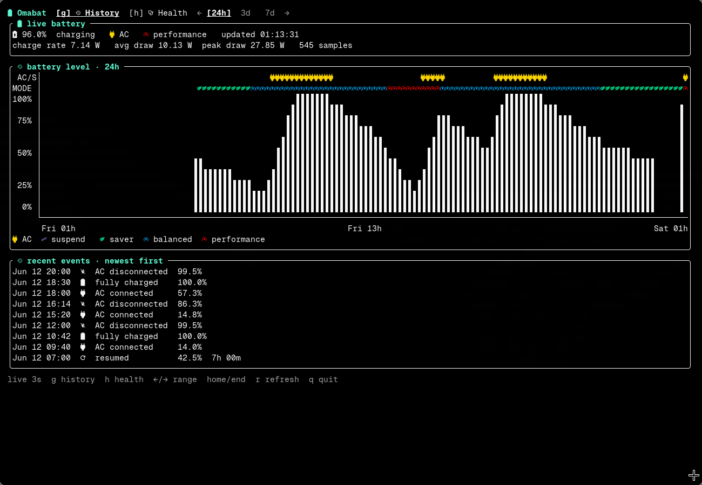

# Omabat

[](https://github.com/nuzair46/omabat/actions/workflows/ci.yml)
[](https://github.com/nuzair46/omabat/releases/latest)
[](https://github.com/nuzair46/omabat/releases)
[](go.mod)
[](LICENSE)

Omabat is a lightweight Linux battery-history daemon and terminal dashboard. Use it to understand battery level changes, charging periods, suspend drain, power profiles, and battery health over time.



## Highlights

- Battery-level history for the last `24h`, `3d`, or `7d`
- AC, suspend, and power-profile timelines
- Average and peak discharge-power statistics
- Battery health, designed capacity, current full capacity, and vendor details
- Immediate live updates while the dashboard is open
- Optional background systemd user service
- Optional Waybar tray battery indicator
- Local SQLite storage with no account or network service

## Install

Install the latest release and start the background collector with one command:

```sh
curl -fsSL https://raw.githubusercontent.com/nuzair46/omabat/main/install.sh | sh
```

The installer detects AMD64 or ARM64, verifies the release checksum, installs Omabat to `~/.local/bin/omabat`, and runs `omabat install` for the current user. No root privileges are required.

Review [`install.sh`](install.sh) before running it, or download an archive manually from [GitHub Releases](https://github.com/nuzair46/omabat/releases/latest).

Omabat requires Linux with `/sys/class/power_supply`. For the intended icon rendering, use a terminal configured with a [Nerd Font](https://www.nerdfonts.com/).

UPower, systemd-logind, `powerprofilesctl`, and Waybar are optional integrations. Omabat falls back to sysfs when UPower is unavailable.

## Start Collecting History

The dashboard records an immediate sample and refreshes every three seconds while open. To keep collecting after closing it, install the user daemon:

```sh
omabat install
```

This installs and starts `~/.config/systemd/user/omabat.service`. The daemon samples every 120 seconds and records readings immediately before suspend and after resume.

If Waybar has an expandable tray group, `omabat install` adds a dynamic Nerd Font battery icon inside it. Clicking the icon opens Omabat. The existing Waybar configuration is backed up before modification.

No root privileges are required.

## Controls

| Key | Action |
| --- | --- |
| `g` / `h` | Open History / Health |
| `←` / `→` | Cycle history ranges |
| `1` / `2` / `3` | Select `24h` / `3d` / `7d` |
| `j` / `k`, `↑` / `↓` | Scroll |
| Page Up / Page Down | Scroll by page |
| Home / End | Jump to top / bottom |
| `r` | Refresh |
| `q` | Quit |

## Commands

```text
omabat [--range 24h|3d|7d]  Open the dashboard
omabat collect              Collect one sample
omabat collect --daemon     Run the collector daemon directly
omabat health               Print current health and available hardware details
omabat demo-data            Create a realistic demo history database
omabat install              Install and enable the user service
omabat version              Print the installed version
```

## Try It With Demo Data

Create a realistic seven-day history without waiting for real samples:

```sh
omabat demo-data --db ./omabat-demo.db --days 7
omabat --db ./omabat-demo.db --range 7d
```

## Data And Privacy

All history stays on your machine in:

```text
${XDG_DATA_HOME:-~/.local/share}/omabat/omabat.db
```

Raw samples are retained for ten days. Hourly aggregates and discrete charging or suspend events are retained for longer-term history.

Omabat reads the primary system battery from UPower and sysfs. Hardware fields that the battery does not expose are omitted.

## Build From Source

Building requires Go 1.24.2 or newer:

```sh
git clone https://github.com/nuzair46/omabat.git
cd omabat
go build -o omabat ./cmd/omabat
./omabat
```

Run the test suite with:

```sh
go test ./...
```

## License

Omabat is available under the [MIT License](LICENSE).
